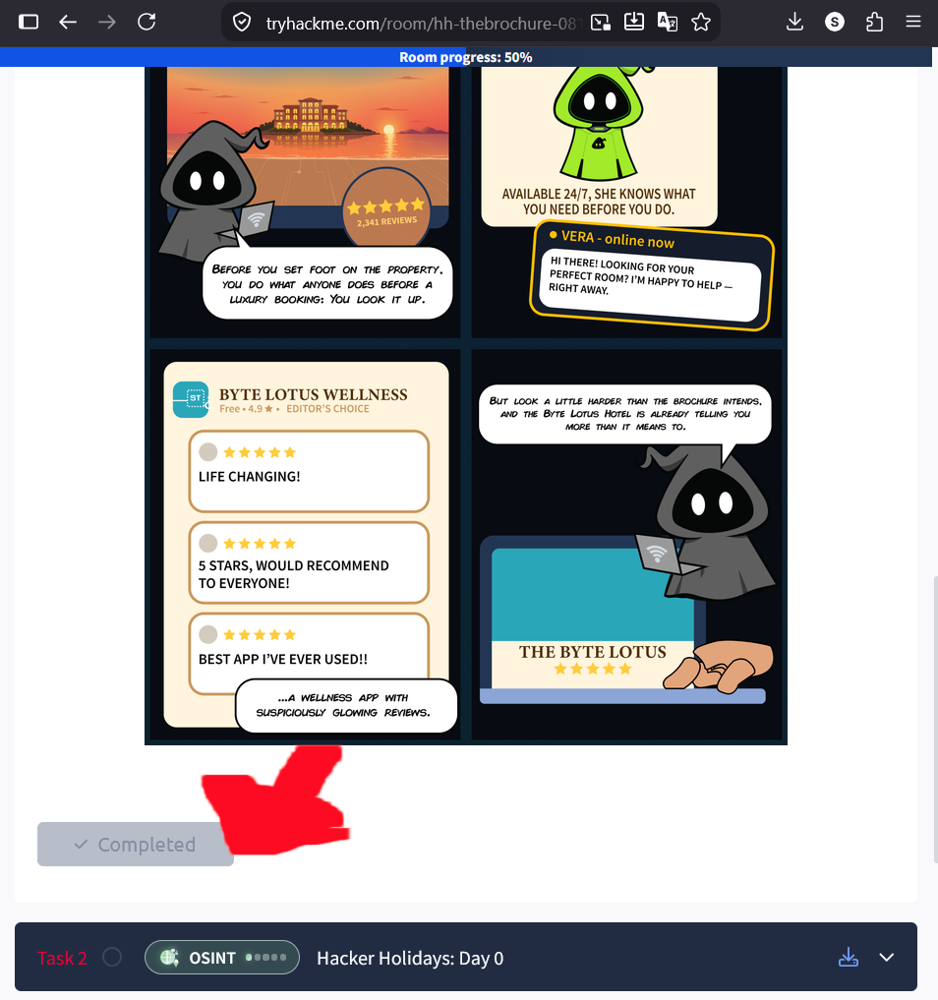
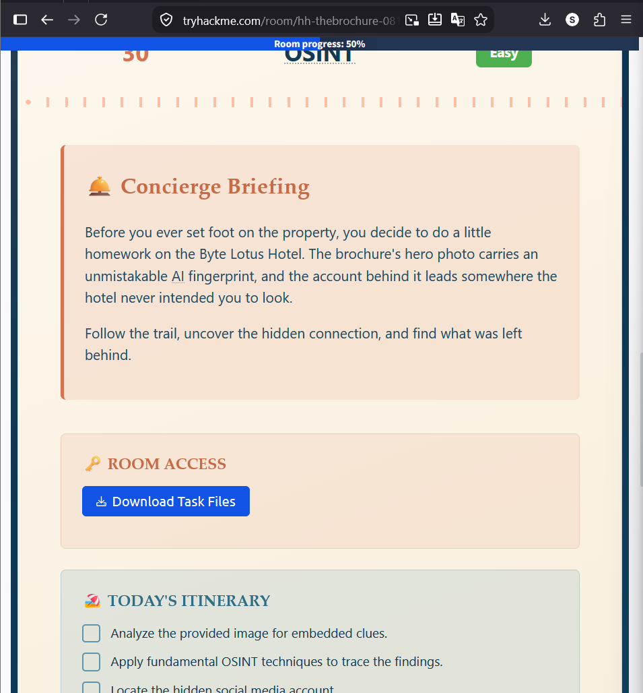
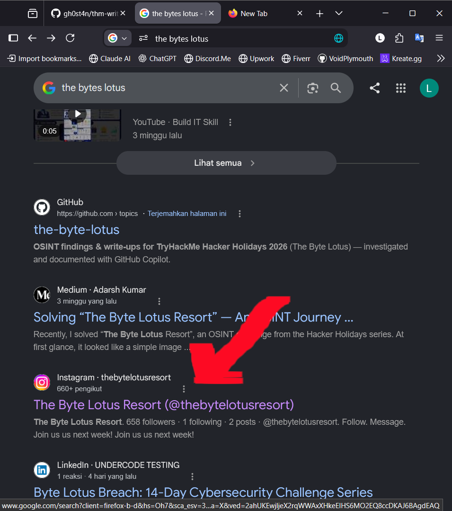
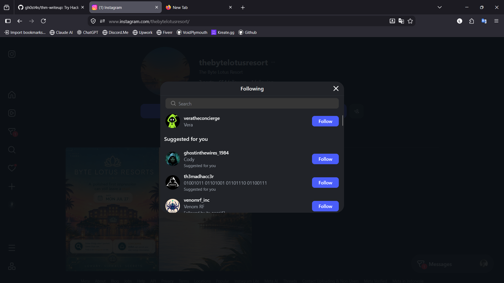
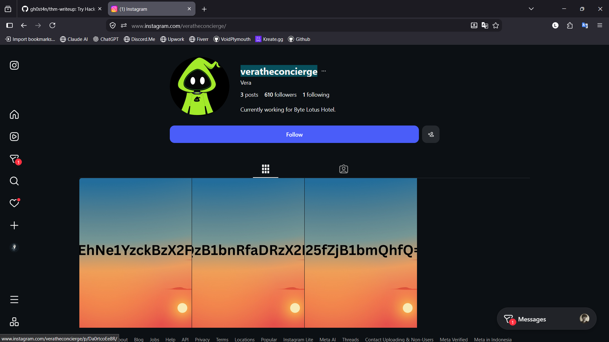
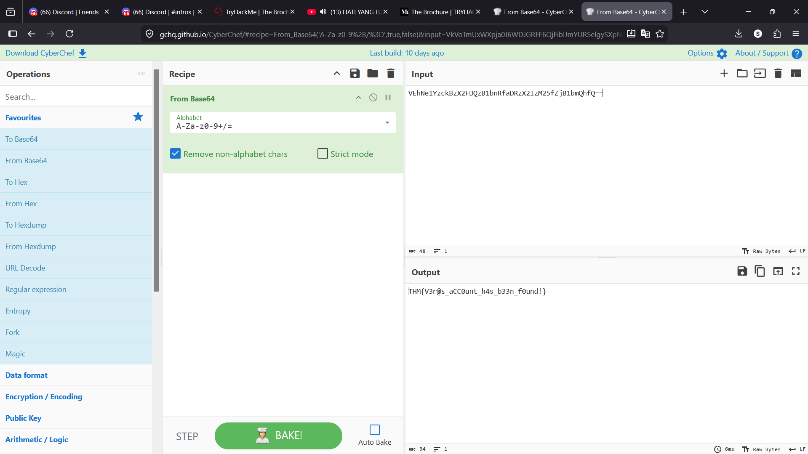
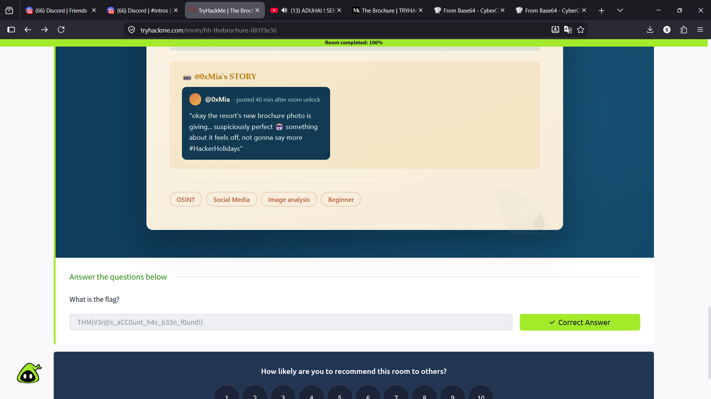

# The Brochure | TRYHACKME | OSINT

Hacker Holiday

### Pertama - Mengidentifikasi
- Click `Mark as Completed `

- Download Task Files pada Task 2 **ROOM ACCESS** dan akan mendapatkan file berupa Zip dan harus di Extract

- Isi File Zip :

### Kedua - Mencari Tau
- Search menggunakan Google Search dengan query `the bytes lotus`, Lalu cari Link instagram

- Dan menemukan Akun tersebut hanya Nge Follow satu Akun dengan username `veratheconcierge`

- Dan disini GW menemukan string Base64

### Ketiga - Menyelesaikan Permasalahan

-  Buka Website CyberChef atau [Link ini](https://gchq.github.io/CyberChef/), dan Pilih opsi **From Baase64**

- Dan Masukkan Output tersebut pada kolom Answer

---

[@T4n-Labs](https://t4n-labs.github.io/site) · [@Gh0sT4n](https://gh0st4n.github.io/site)

